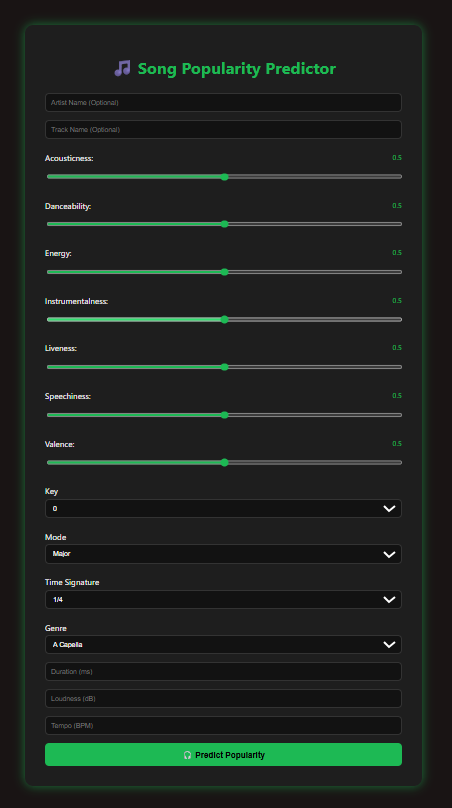

# 🎧 Song Popularity Predictor (Spotify)

A web app that predicts the popularity of a Spotify song **before it's released**, using machine learning models trained on real audio features.  
Users can input features like danceability, energy, valence, and instantly get a predicted popularity score from 0 to 100.

---

## 🚀 Features

- 🎶 Input real audio attributes: danceability, energy, tempo, acousticness, etc.
- 📊 Predict **Spotify popularity score (0–100)** for unreleased songs
- 🤖 Trained on real-world Spotify dataset (17,000+ tracks)
- 🧠 Supports both **XGBoost** and **Linear Regression** models
- 🖥️ Web app built using **Flask + HTML/CSS**
- ✅ Integrated `.pkl` model for instant predictions

---

## 🖥️ Tech Stack

| Layer        | Technology            |
|--------------|------------------------|
| ML Model     | XGBoost, Scikit-learn  |
| Backend      | Python (Flask)         |
| Frontend     | HTML, CSS              |
| Data         | `SpotifyFeatures.csv`  |
| Model File   | `spotify_model.pkl`    |

---

### 🎯 Prediction Page UI

---

